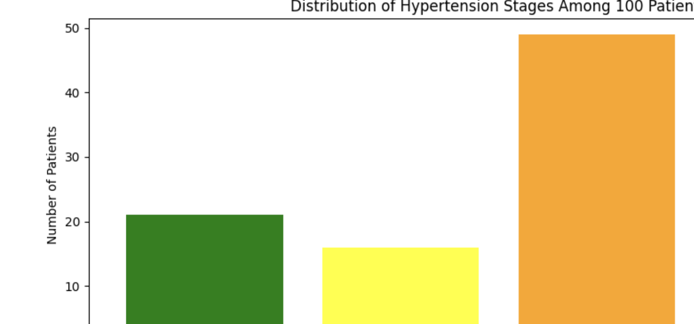

# Overview

## Short Description

Generate and view a histogram for blood pressure readings

## Long Description

This repository contains workbooks and data to analyze blood pressure readings for a patient population. The data provided here is randomly generate and is not drawn from any actual patient population. However, you should be able to swap out different data files. 

## Workbooks

[BP_Analysis.ipynb](BP_Analysis.ipynb)

## Data

## Visualizations

## References

The analysis uses the hypertension categories defined in:

https://www.mayoclinic.org/diseases-conditions/high-blood-pressure/in-depth/blood-pressure/art-20050982
